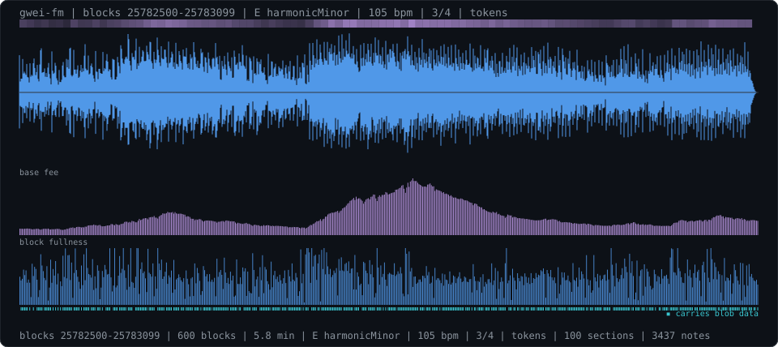

<div align="center">

# gwei-fm

**Every stretch of Ethereum is a different song. This plays it.**

[](https://www.typescriptlang.org/)
[](https://nodejs.org/)
[](#development)
[](package.json)
[](LICENSE)

</div>

---

Every twelve seconds Ethereum commits a block, and every block is a small record of what people were doing: trading, sending money, shipping contracts, posting rollup batches. gwei-fm reads a stretch of those blocks and composes it — and the *style* is not yours to pick. **The chain picks it.**

Key, mode, tempo, meter, swing, the instruments, the size of the room: every one is derived from the blocks themselves. A volatile trading hour and a sleepy transfer-heavy night are not two renderings of one track — they are two different genres. And because the derivation is deterministic, each stretch of chain history has exactly one song, forever.

```
$ gwei-fm --from 25782500 --to 25782799 --style
  the chain chose: E harmonicMinor | 105 bpm | 3/4 | tokens
  saw-lead / warm-pad / pluck-bass / kick-soft snare-noise shaker

$ gwei-fm --from 25787880 --to 25788179 --style
  the chain chose: D# minor | 88 bpm | 4/4 | transfers
  pluck / warm-pad / sub-bass / kick-soft snare-tight hat-closed

$ gwei-fm --from 25703034 --to 25703333 --style
  the chain chose: B dorian | 92 bpm | 4/4 | tokens
  saw-lead / warm-pad / saw-bass / kick-hard snare-clap shaker
```

<sub>Three real ranges, three styles, none chosen by a human. Measured on the rendered audio, the first is 3.2x brighter than the second and their detected pulses differ — these are different pieces, not different labels.</sub>

<p align="center">
  
</p>

**Listen:** [the fee spike](assets/demo-spike.wav) · [a quiet night](assets/demo-night.wav) · [ten days earlier](assets/demo-aug7.wav) — GitHub does not play audio inline; download or clone.

## Quick start

No API keys. It reads blocks from public RPC endpoints.

```bash
git clone https://github.com/daronthedragon/gwei-fm.git
```

```bash
cd gwei-fm && npm install && npm run build && npm link
```

```bash
gwei-fm --last 300 -o tonight.wav --svg tonight.svg
```

Node 20+. Zero runtime dependencies — the synth, the reverb, the WAV encoder and the RPC client are all in the repo.

| Flag | Default | Meaning |
| :--- | :--- | :--- |
| `--last <n>` | `300` | The most recent n blocks |
| `--from <block> --to <block>` | — | An exact range instead |
| `--style` | — | Print what the chain chose and exit, no audio |
| `-o, --out <file>` | `gwei-fm.wav` | |
| `--svg <file>` | — | Draw the waveform with the block data under it |
| `--rpc <url>` | public | Your own endpoint, repeatable |

There is deliberately no `--key` or `--bpm`. The chain decides.

## How the chain chooses

**The seed is RANDAO.** Every block carries a `mixHash` — the beacon chain's randomness reveal, unpredictable before the block landed and immutable after. The opening block's mixHash seeds everything genuinely arbitrary: which of the twelve keys, tie-breaks between modes, a few BPM of character. Things that should *mean* something are read off the data directly:

| Decision | Derived from |
| :--- | :--- |
| **Key** | Opening block's RANDAO |
| **Mode** | Fee volatility — a flat day is major or lydian; a wild one reaches phrygian, harmonic minor, whole-tone |
| **Tempo** | Average fullness picks the band, volatility pushes it faster |
| **Meter** | Mostly 4/4; sometimes 3/4; deploy-heavy ranges can land in 5 or 7 |
| **Swing** | How unevenly blocks actually arrived |
| **Room** | Rollup-heavy ranges are vast and washy; transfer-heavy ones dry and close |
| **The band** | What the transactions did (see below) |

**Transactions pick the instruments.** Every transaction in the range is classified from its calldata — DEX swaps by router selector, ERC-20 transfers, plain sends, deployments, blob batches — and the range's character selects the palette: a swap-heavy hour gets squares, acid bass and hard drums; a transfer-heavy night gets plucks, bells and a shaker; rollup traffic gets choir pads over a sub. RANDAO picks within the palette.

**Blocks colour their own beat.** Inside the piece, each block's own mix keeps steering: token traffic drives the arpeggio, swap share drives the acid line's filter, a **contract deployment rings a bell** — something new exists — and fullness sets each note's brightness, not just its volume.

**The rest of the composition** carries over from the data directly: one block per beat; intensity (fee-weighted, normalised to the piece, damped by how far fees really moved) decides the chord's reach through a cadence that always returns to `i`, and which instruments are playing at all; the melody plays a RANDAO-seeded motif that drifts toward where the fee points; a missed slot is an audible rest; the drums only fully arrive in a surge.

## What that means for uniqueness

A rendered piece is the unique song of its slice of history, in the strongest sense available:

- **No two ranges share a seed** — mixHash is per-block randomness.
- **No two ranges share a performance** — the notes are the traffic.
- **The same range is always the same song** — byte-identical, down to the noise in the hat. Anyone can re-render blocks 25782500-25782799 and get exactly this file.

It is a wind chime the size of the fee market: the instrument is built, the wind writes the piece, and this wind never blows twice.

## Development

```bash
npm test
```

24 tests, in three groups. **Style:** different seeds spread across keys; volatile ranges go dark while flat ones go bright; packed chains are faster; transaction mixes pick the right character and band; uneven arrival swings; derivation is deterministic. **Composer:** every pitched note is in the derived key across modes including pentatonic and lydian; odd meters put the downbeats where the meter says; the cadence opens on `i` and returns; drums and arp drop out in the calm; a deployment rings its bell on the right block; swing lands late; the motif never leaps wildly; missed slots stretch and absurd gaps clamp. **Synth:** every instrument combination renders finite and clip-free; stereo differs; busy is louder than calm; rendering is deterministic; the WAV clamps instead of wrapping.

The NaN test earned its place: an early register clamp produced a fractional scale degree, which indexed off the end of the mode array and silently rendered whole sections at `NaN` Hz. The fix is at both layers, and the test renders every instrument family to catch the next one.

```bash
npm run typecheck
npm run build
```

## License

MIT
